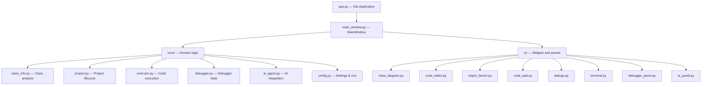

# Architecture overview

BlueP is a GTK4 desktop application written in Python 3.14, using PyGObject for
GTK bindings. It follows a layered architecture:

## Layers

| Layer | Responsibility |
|---|---|
| `app.py` | Application lifecycle, CSS theme loading, command-line handling |
| `ui/` | GTK widgets: main window, diagram, editor, bench, panels |
| `core/` | Domain logic: class analysis, project model, executor, debugger |
| `config.py` | Settings dataclasses, env loading, JSON persistence |

## Design principles

- **Visual-first**: class diagrams and object bench are the primary interface.
- **Config-driven**: all editor and Python settings flow through `Config`.
- **Graceful degradation**: the editor falls back to plain `Gtk.TextView` when
  GtkSourceView is unavailable.
- **Deployment-safe**: supervised mode is an environment lock, not a pref.
